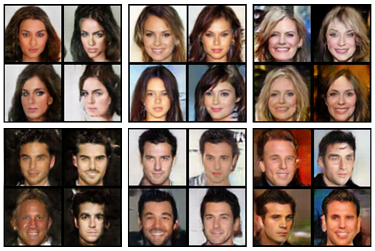
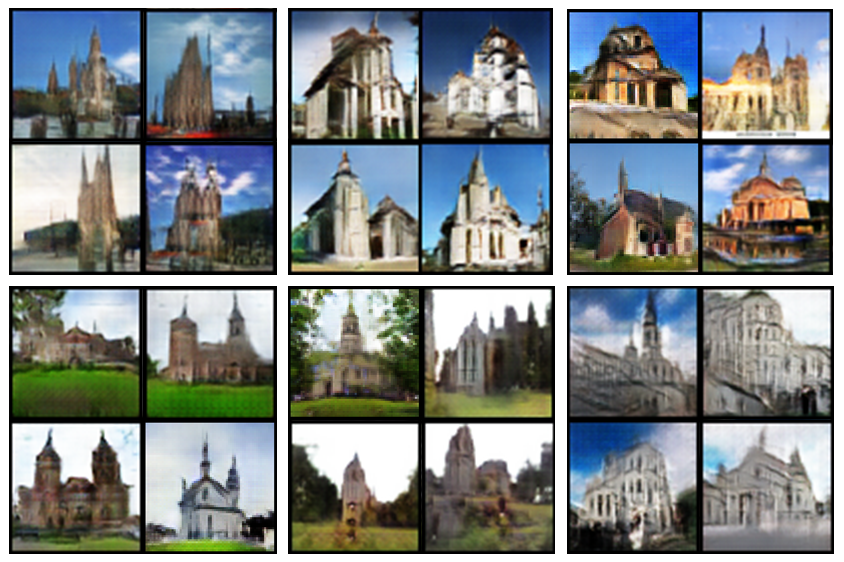

# MEGAN
This repository is under construction. Please wait for the update slated to the nearest future!
Implementation of MEGAN: Mixture of Experts of Generative Adversarial Networks for  Image Generation via Categorical Reparameterization
<p align="center"></p>

--------------------------------------------------------------------------------
This repository provides a PyTorch implementation of [Mixture of Experts GAN](ARXIV). Each generator in MEGAN is capable of learning salient and distinct features.

<p align="center"></p>

&nbsp;

## Paper
[MEGAN: Mixture of Experts of Generative Adversarial Networks for Multimodal Image Generation](ARXIV) <br/>
[David Keetae Park<sup>1</sup>](https://github.com/heykeetae), [Seungjoo Yoo<sup>1</sup>](https://github.com/sjooyoo), [Hyojin Bahng<sup>1</sup>](https://github.com/hjbahng), [Jaegul Choo<sup>1</sup>](https://sites.google.com/site/jaegulchoo/), and [Noseong Park<sup>2</sup>](https://sites.google.com/view/npark)<br/>
&nbsp;&nbsp; **<sup>1</sup>Korea University &nbsp;&nbsp;&nbsp; <sup>2</sup>University of North Carolina, Charlotte**

&nbsp;
&nbsp;

## Model Description
### Main Networks and Gating Networks
<p align="center"></p>
The proposed architecture of MEGAN; <b>(a)</b> shows the overview of our main networks. Given a latent vector <b>z</b>, each of the n generators produces an output o<sub>i</sub>. The latent vector <b>z</b> and n feature vectors (denoted in yellow) extracted from the generators are given as input to the gating networks that produce a one-hot vector <b>g</b>, as shown in the middle. The chosen image by the one-hot vector (marked as "Fake Image") will be fed into the discriminator that measures the adversarial loss with regard to both real and fake classes. <b>(b)</b> illustrates an in-depth view on the gating networks. The gating networks output a one-hot vector <b>g</b>.

&nbsp;
&nbsp;


## Results
### On CelebA dataset
<p align="center"></p>
64x64 samples from MEGAN with each block of four images generated by the same generator. Noticeable differences between each block indicate that different generators produce images with different features.

### LSUN-Church outdoor
<p align="center"></p>
64x64 samples from MEGAN with each block of four images generated by the same generator. Distinguishable features include the church architectural style, the location, and the cloud cover.

## Prerequisites
* [Python 3.5+](https://www.continuum.io/downloads)
* [PyTorch 0.3.1](http://pytorch.org/)

&nbsp;

## Usage
(codes and guidelines will be updated shortly!)
#### 1. Clone the repository

#### 2. Dataset & Libraries install

#### 3. Train 

## Citation
If this work is useful for your research, please cite our [paper](ARXIV).
```
REFERENCE to be announced
```
&nbsp;


